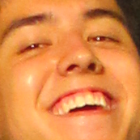

### САТТАРОВ МАРАТ КУДДУСОВИЧ  

> 

Родился 25 сентября 1996 года в г. Уфа, Республика Башкортостан. После получения среднего образования получил степень бакалавра по специальности "Химическая технология природных энергоносителей и углеродных материалов", а также степень магистра по специальности "Экономика предприятий и организаций (нефтяной и газовой промышленности)". 

В 2022 внезапно решил научиться программированию.

#### Компетенции, навыки и умения

- Основы языка C#;

- Основы языка Java;

- Пользование IDE: Microsoft Visual Studio, IntelliJ IDEA;

- Английский язык (Upper Intermediate).

